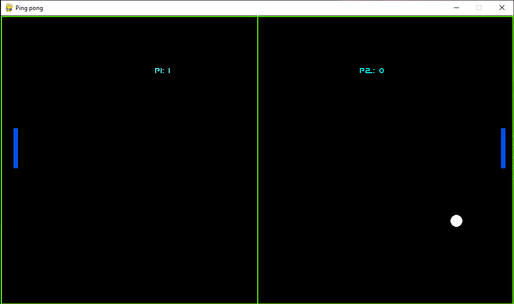

# ping_pong
Ping_pong game in python

The game is a bit basic, I tried to make the ball move as well as possible without following a *-1 pattern, I did it using adding small random numbers to the movement of the ball,

It has pj vs pj mode, pj vs pc, pc vs pc to see and bet who wins XD.

It has a lan and online mode, the latter using the ngrok service, depending on the connection it can be playable, but more than anything it is a test.

It has some bugs that make you think the game has crashed, but that's not the case.

I have tried to make the connection close when it is opened, to avoid closing and opening it again, but to no avail.

If the console says that there is already a connection using the port, or when the connection is closed and one player is left alone, just close and reopen the game.

I'm still a bit of a noob, but I'll fix all the bugs.

"Thanks for playing my game", as "james halliday" would say from the movie "ready player one"
